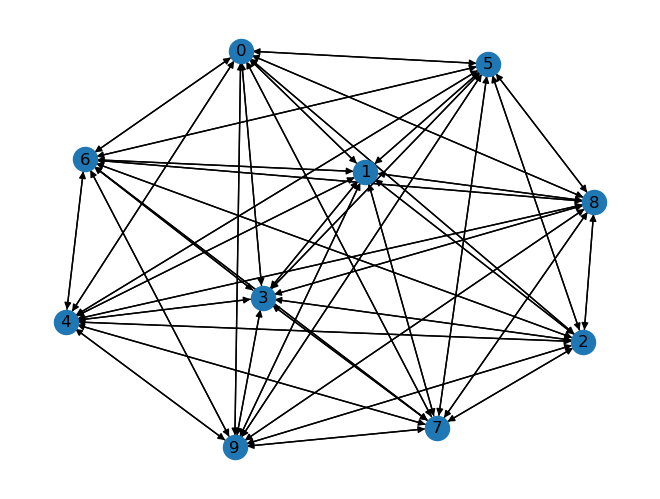
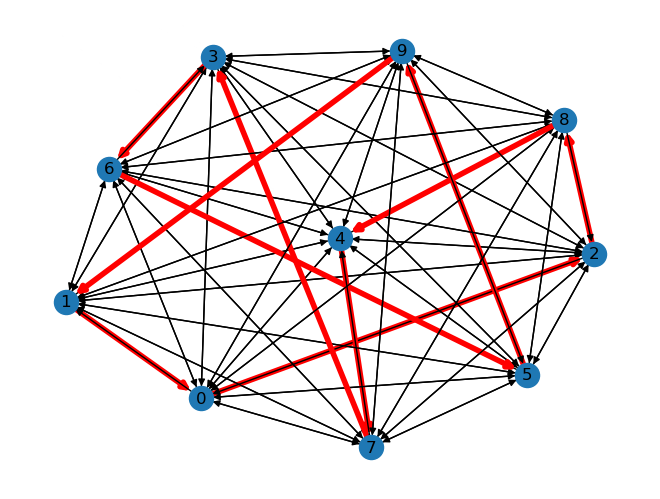
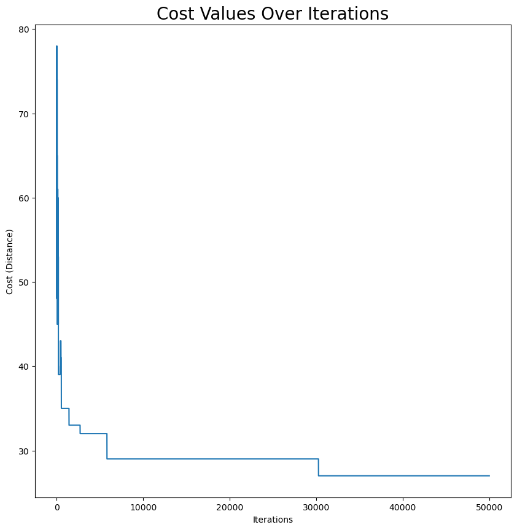
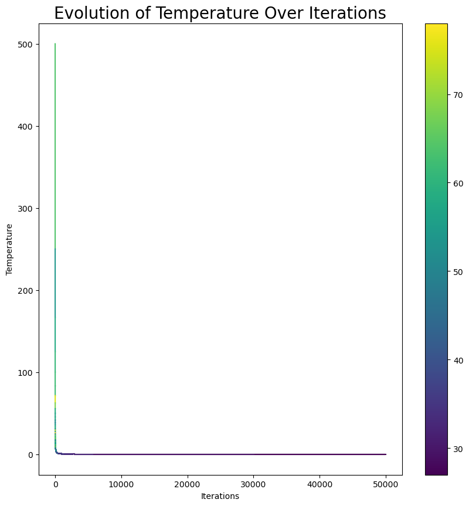

# Simulated Annealing for the Traveling Salesman Problem

This repository presents a novel implementation of the Simulated Annealing (SA) algorithm to address the classic Traveling Salesman Problem (TSP). The TSP is a quintessential example of combinatorial optimization, where the goal is to find the shortest possible route that visits a set of cities and returns to the original city, minimizing the total travel distance. 

## Visualizations

### Initial TSP Graph Configuration

*The complete graph representing the initial state of the TSP, with nodes as cities and edges as paths, showcasing the complexity of the problem.*

### Optimized TSP Route

*The optimized graph post-Simulated Annealing, highlighting the most efficient route (in red) that significantly reduces the total travel distance.*

### Cost Reduction Over Iterations

*Graph depicting the decrease in total route cost as a function of iterations, demonstrating the algorithm's effectiveness in finding a lower-cost solution.*

### Temperature Decay Over Iterations

*A visualization of the temperature decay and its correlation with cost reduction over iterations, indicative of the annealing process toward solution stabilization.*

## Theoretical Background

The Simulated Annealing algorithm is inspired by the physical process of annealing in metallurgy. It is a probabilistic technique for approximating the global optimum of a given function. Specifically, the algorithm navigates the solution space of the TSP by mimicking the cooling process of metals, where gradual temperature reductions lead to a stable minimum energy state. The SA approach is defined by the following key components:

- **Initial State**: A randomly generated tour of the cities.
- **Energy Function**: The total distance of the tour, given by $D(\sigma) = \sum_{i=1}^{N-1} d(\sigma_i, \sigma_{i+1}) + d(\sigma_N, \sigma_1)$ where $d(\sigma_i, \sigma_j)$ is the distance between city $i$ and $j$, and $\sigma$ is a permutation of the cities.
- **Temperature Schedule**: A function that controls the cooling of the system, typically in the form $T(k) = \frac{T_0}{\log(1+k)}$, where $k$ is the current iteration.
- **Acceptance Probability**: The probability of accepting a worse solution, defined as $P(\Delta E, T) = e^{-\Delta E / T}$, where $\Delta E$ is the change in energy, and $T$ is the current temperature.

## Project Flow

1. **Initialization**: Start with an initial tour and an initial temperature.
2. **Iteration**: At each iteration, generate a new tour by making a slight change to the current tour.
3. **Evaluation**: Calculate the change in distance $\Delta D$ for the new tour.
4. **Metropolis Criteria**: Decide whether to accept the new tour based on the acceptance probability.
5. **Cooling**: Reduce the temperature according to the cooling schedule.
6. **Termination**: Repeat the iteration process until the system stabilizes at a minimum distance or a preset number of iterations is reached.

